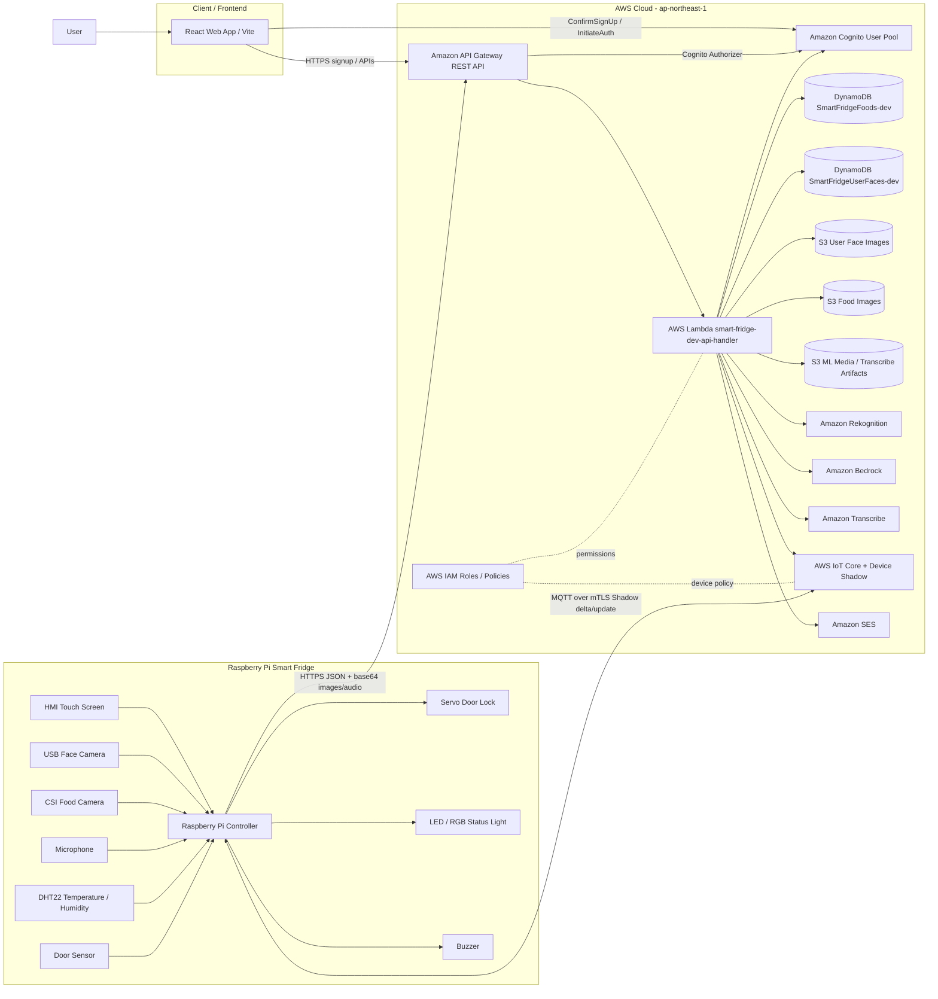

# Smart Fridge 系統架構圖生成文檔

本文件可直接提供給 AI 繪圖工具，用來生成本專案的系統架構圖。專案分為三大區塊：Web 前端、AWS 雲端後端、Raspberry Pi 智慧冰箱硬體端。

## 一句話描述

這是一個智慧冰箱系統。使用者透過 React Web App 註冊、登入、上傳人臉、查看庫存與裝置狀態；Raspberry Pi 透過相機、麥克風、門鎖、LED、溫濕度感測器執行存取食物流程；AWS Serverless 後端負責 API、身分驗證、人臉辨識、食物辨識、到期日語音解析、資料儲存、IoT Device Shadow 裝置控制，以及非物主取食物時的 email 通知。

## 架構圖 Prompt

請生成一張清楚的 AWS 智慧冰箱系統架構圖，版面由左到右分成三個區域：

1. 左側：Client / Frontend
2. 中間：AWS Cloud Backend
3. 右側：Edge Device / Raspberry Pi Smart Fridge

請使用 AWS 官方服務圖示或相近雲端架構圖風格。請用箭頭標示資料流與協定。

### Client / Frontend 區域

放置一個「React Web App / Vite Frontend」節點，代表使用者使用的網頁介面。

React Web App 功能：

- 使用者註冊、確認帳號、登入
- 上傳本人臉部照片註冊人臉
- 查看我的冰箱食物庫存
- 查看裝置狀態，例如 lock、led、temperature、humidity、lastSeenAt
- 開發頁面可測試放食物、取食物 API

React Web App 對 AWS 的連線：

- 直接呼叫 Amazon Cognito User Pool 的 ConfirmSignUp / InitiateAuth 進行帳號確認與登入
- 透過 HTTPS 呼叫 Amazon API Gateway
- 帶 Cognito ID token 呼叫需要授權的 API，例如 /foods/me、/users/me/face、/device/{deviceId}/state、/device/{deviceId}/lock

### AWS Cloud Backend 區域

請用一個 AWS Cloud 外框包住下列服務：

- Amazon API Gateway：REST API 入口，stage 為 dev，URL 類似 https://v6ylyjtxga.execute-api.ap-northeast-1.amazonaws.com/dev
- Amazon Cognito User Pool：使用者註冊、登入、ID token，User Pool Client 給前端使用
- AWS Lambda：smart-fridge-dev-api-handler，Node.js API handler，處理所有主要 API 路由
- Amazon DynamoDB：兩張表
  - SmartFridgeFoods-dev：食物庫存資料表，主鍵 foodId，GSI OwnerExpirationIndex(ownerUserId, expirationDate)
  - SmartFridgeUserFaces-dev：Cognito user 與 Rekognition FaceId 對應表，主鍵 userId，GSI FaceIdIndex(rekognitionFaceId)
- Amazon S3：儲存圖片與 ML 暫存資料
  - smart-fridge-user-faces-dev-491919374787：使用者人臉照片
  - smart-fridge-food-images-dev-491919374787：食物照片
  - ml-smart-fridge-media-<account>-ap-northeast-1-an：語音檔與 Transcribe 輸出暫存
- Amazon Rekognition：
  - IndexFaces：註冊使用者人臉
  - SearchFacesByImage：人臉認證與物主檢查
  - DetectLabels：食物影像輔助標籤
  - CollectionId：ml-smart-fridge-faces
- Amazon Bedrock：
  - 食物影像分類，根據圖片與 Rekognition labels 對應到專案食物 catalog
  - 到期日語音文字解析，例如「三個月後」轉成 P3M，再換算 expirationDate
- Amazon Transcribe：
  - 將到期日語音轉成文字 transcript
- AWS IoT Core：
  - IoT Thing：smart-fridge-001
  - Device Shadow：儲存 desired / reported 狀態
  - desired：lock、led
  - reported：lock、led、temperature、humidity、lastSeenAt
- Amazon SES：
  - 非物主取走食物時寄送 email 通知物主
- AWS IAM：
  - Lambda execution role
  - IoT device policy
  - S3 / DynamoDB / Rekognition / Transcribe / Bedrock / IoT / SES 權限
- AWS SAM / CloudFormation：
  - 用 template.yaml 管理與部署上述雲端資源

### Raspberry Pi Smart Fridge 區域

放置一個「Raspberry Pi Smart Fridge」節點，內含以下硬體與程式模組：

- HMI 觸控螢幕 / CLI 模擬操作
- USB 人臉相機：拍攝使用者人臉
- Raspberry Pi CSI 食物相機：拍攝食物
- 麥克風：錄製到期日語音
- SG90 伺服馬達門鎖：locked / unlocked
- RGB 狀態燈與 LED：processing、success、error、alert
- 蜂鳴器：錯誤或警示音
- DHT22 溫濕度感測器：temperature、humidity
- 磁簧門感測器：偵測門開關

Raspberry Pi 對 AWS 的連線：

- 透過 HTTPS + JSON + base64 呼叫 API Gateway：
  - POST /auth/face：送人臉照片做人臉認證
  - POST /foods/put：送食物照片與到期日語音，新增食物資料
  - POST /foods/retrieve：送取用者與食物照片，檢查是否為物主並刪除食物資料
  - POST /expiration/parse：單獨解析到期日語音
- 透過 AWS IoT Core MQTT over mTLS 連線 Device Shadow：
  - 訂閱 $aws/things/smart-fridge-001/shadow/update/delta
  - 回報 $aws/things/smart-fridge-001/shadow/update
  - reported 上報 lock、led、temperature、humidity、lastSeenAt
  - 接收 desired lock / led 指令，例如遠端開鎖或非物主警示

## 主要資料流

### 1. 使用者註冊與登入

1. 使用者在 React Web App 輸入 email / password。
2. React Web App 呼叫 API Gateway 的 POST /auth/signup。
3. API Gateway 觸發 Lambda。
4. Lambda 呼叫 Amazon Cognito SignUp 建立帳號。
5. 使用者收到 Cognito 驗證碼。
6. React Web App 直接呼叫 Cognito ConfirmSignUp 完成驗證。
7. React Web App 直接呼叫 Cognito InitiateAuth 登入並取得 ID token。

圖上標示：

- React Web App -> API Gateway：HTTPS /auth/signup
- Lambda -> Cognito：SignUp
- React Web App -> Cognito：ConfirmSignUp, InitiateAuth

### 2. 人臉註冊

1. 使用者登入後，在 React Web App 上傳人臉照片。
2. React Web App 帶 Cognito ID token 呼叫 POST /users/me/face。
3. API Gateway 使用 Cognito Authorizer 驗證 token。
4. Lambda 從 token claims 取得 Cognito userId。
5. Lambda 將人臉照片寫入 S3 user face bucket。
6. Lambda 呼叫 Rekognition IndexFaces，將臉加入 collection。
7. Lambda 將 userId 與 rekognitionFaceId 對應寫入 DynamoDB UserFaceTable。

圖上標示：

- React Web App -> API Gateway：HTTPS + ID token
- API Gateway -> Lambda
- Lambda -> S3：PutObject face image
- Lambda -> Rekognition：IndexFaces
- Lambda -> DynamoDB：PutItem user-face mapping

### 3. 存食物流程

1. 使用者在 Raspberry Pi HMI 選擇「存食物」。
2. Pi 使用人臉相機拍照，呼叫 POST /auth/face。
3. Lambda 呼叫 Rekognition SearchFacesByImage，並查 DynamoDB UserFaceTable 找出使用者。
4. 認證成功後，Pi 解鎖門鎖，使用者放入食物。
5. Pi 使用食物相機拍攝食物照片，使用麥克風錄製到期日語音。
6. Pi 呼叫 POST /foods/put，上傳食物照片與音訊 base64。
7. Lambda 將食物照片存入 S3 food image bucket。
8. Lambda 使用 Rekognition DetectLabels 與 Bedrock 進行食物分類。
9. Lambda 將音訊存入 ML S3 bucket，呼叫 Transcribe 轉文字。
10. Lambda 使用 Bedrock 將 transcript 解析成到期日 duration，再換算 expirationDate。
11. Lambda 將 foodId、ownerUserId、ownerEmail、foodName、expirationDate、deviceId 寫入 DynamoDB FoodTable。
12. Pi 關門後上鎖，並回報 Device Shadow reported.lock = locked。

圖上標示：

- Raspberry Pi -> API Gateway：HTTPS /auth/face, /foods/put
- Lambda -> Rekognition：SearchFacesByImage, DetectLabels
- Lambda -> Bedrock：food classification, duration parsing
- Lambda -> S3：PutObject food image, audio artifact
- Lambda -> Transcribe：StartTranscriptionJob / GetTranscriptionJob
- Lambda -> DynamoDB：PutItem food
- Raspberry Pi -> IoT Core Device Shadow：MQTT reported lock / climate

### 4. 取食物流程

1. 使用者在 Raspberry Pi HMI 選擇「取食物」。
2. Pi 拍攝人臉照片並呼叫 POST /auth/face。
3. 認證成功後，Pi 解鎖門鎖。
4. 使用者拿出食物並在食物相機前拍攝。
5. Pi 呼叫 POST /foods/retrieve。
6. Lambda 使用 Rekognition + Bedrock 分類食物。
7. Lambda 從 DynamoDB 找出對應食物資料。
8. Lambda 比對 actorUserId / actorEmail 是否符合 food owner。
9. 如果是物主：Lambda 刪除 DynamoDB FoodTable 的該 food item，回傳 authorized=true。
10. 如果不是物主：Lambda 回傳 authorized=false，呼叫 SES 寄信給物主，並更新 IoT Device Shadow desired.led = alert。
11. Pi 端收到 Shadow delta 後觸發 LED 警示與蜂鳴器。

圖上標示：

- Raspberry Pi -> API Gateway：HTTPS /foods/retrieve
- Lambda -> DynamoDB：Query/Get/Delete food item
- Lambda -> SES：SendEmail owner alert
- Lambda -> IoT Core Device Shadow：UpdateThingShadow desired.led=alert
- IoT Core -> Raspberry Pi：MQTT Shadow delta

### 5. 前端查看庫存與裝置狀態

1. React Web App 帶 ID token 呼叫 GET /foods/me。
2. Lambda 查 DynamoDB FoodTable 的 OwnerExpirationIndex，回傳目前使用者食物庫存，依到期日排序。
3. React Web App 帶 ID token 呼叫 GET /device/{deviceId}/state。
4. Lambda 從 IoT Device Shadow 讀取 reported 狀態，回傳 lock、led、temperature、humidity、lastSeenAt。

圖上標示：

- React Web App -> API Gateway：HTTPS + ID token
- Lambda -> DynamoDB：Query OwnerExpirationIndex
- Lambda -> IoT Core Device Shadow：GetThingShadow

## AWS 服務清單

| AWS 服務 | 在本專案中的用途 |
| --- | --- |
| Amazon API Gateway | 對前端與 Raspberry Pi 提供 REST API 入口 |
| AWS Lambda | Node.js 後端邏輯，處理 signup、face auth、food put/retrieve、device state |
| Amazon Cognito User Pool | 使用者註冊、帳號確認、登入、ID token、API 授權 |
| Amazon DynamoDB | 儲存食物庫存與 Cognito user 對 Rekognition FaceId 的 mapping |
| Amazon S3 | 儲存人臉照片、食物照片、語音與 Transcribe 暫存輸出 |
| Amazon Rekognition | 人臉註冊、人臉搜尋、食物影像 labels 偵測 |
| Amazon Bedrock | 食物影像分類與到期日語意解析 |
| Amazon Transcribe | 將到期日語音轉成文字 |
| AWS IoT Core | Raspberry Pi MQTT/mTLS 連線與 IoT Thing 管理 |
| AWS IoT Device Shadow | 儲存裝置 desired/reported 狀態，遠端控制 lock / led，回報溫濕度 |
| Amazon SES | 非物主取食物時寄送 email 通知 |
| AWS IAM | Lambda execution role、IoT device policy、各服務權限控管 |
| AWS SAM / CloudFormation | 以 Infrastructure as Code 部署 API、Lambda、DynamoDB、S3、Cognito、IoT、SES 等資源 |

## 實際部署資訊

- AWS Region：ap-northeast-1
- API Gateway Base URL：https://v6ylyjtxga.execute-api.ap-northeast-1.amazonaws.com/dev
- Cognito User Pool ID：ap-northeast-1_HIySrbd1y
- Cognito User Pool Client ID：58u2jdcqh3l2r7or7uctogai9n
- DynamoDB Food Table：SmartFridgeFoods-dev
- DynamoDB User Face Table：SmartFridgeUserFaces-dev
- S3 Face Image Bucket：smart-fridge-user-faces-dev-491919374787
- S3 Food Image Bucket：smart-fridge-food-images-dev-491919374787
- Rekognition Collection ID：ml-smart-fridge-faces
- Face Match Threshold：85
- IoT Thing Name：smart-fridge-001
- IoT Device Policy：smart-fridge-dev-device-policy
- Raspberry Pi IoT Endpoint：a2ddn1ymw51sga-ats.iot.ap-northeast-1.amazonaws.com

## API 路由整理

| Route | 使用者 | 功能 | 主要後端服務 |
| --- | --- | --- | --- |
| POST /auth/signup | Frontend | 註冊 Cognito 使用者 | Cognito |
| POST /auth/face | Raspberry Pi / Frontend dev | 人臉認證 | Rekognition, DynamoDB |
| POST /users/me/face | Frontend | 登入使用者註冊人臉 | Cognito Authorizer, S3, Rekognition, DynamoDB |
| GET /foods/me | Frontend | 查詢我的庫存 | Cognito Authorizer, DynamoDB |
| POST /foods/put | Raspberry Pi / Frontend dev | 新增食物 | S3, Rekognition, Bedrock, Transcribe, DynamoDB |
| POST /foods/detect | Frontend dev | 食物影像辨識測試 | Rekognition, Bedrock |
| POST /expiration/parse | Raspberry Pi / Frontend dev | 到期日語音解析 | S3, Transcribe, Bedrock |
| POST /foods/retrieve | Raspberry Pi / Frontend dev | 取食物與物主檢查 | Rekognition, Bedrock, DynamoDB, SES, IoT Shadow |
| POST /test/owner-check | Frontend dev | 測試人臉是否為食物物主 | Rekognition, DynamoDB |
| GET /device/{deviceId}/state | Frontend | 查看裝置狀態 | Cognito Authorizer, IoT Device Shadow |
| POST /device/{deviceId}/lock | Frontend | 遠端更新門鎖 desired 狀態 | Cognito Authorizer, IoT Device Shadow |

## 架構圖標註建議

請在圖上特別標示兩條雲端通訊路徑：

1. Business API Path：Frontend / Raspberry Pi -> HTTPS -> API Gateway -> Lambda -> DynamoDB / S3 / Rekognition / Bedrock / Transcribe / SES
2. Device Control Path：Raspberry Pi <-> MQTT over mTLS <-> AWS IoT Core Device Shadow；Lambda 也可透過 IoT Data Plane 讀寫 Shadow

請避免把照片、音訊、食物資料畫進 Device Shadow。Device Shadow 只放裝置狀態與硬體指令，例如 lock、led、temperature、humidity、lastSeenAt。

## Mermaid 參考圖

如果繪圖 AI 支援 Mermaid，可先用下列圖作為結構基礎：

